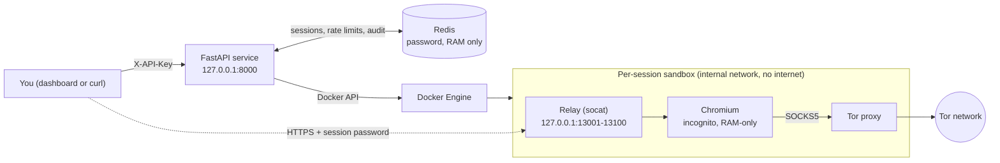

# Private Browser


A self-hosted service that gives you a **disposable, isolated browser** on demand. Each session is a fresh incognito Chromium running in its own Docker sandbox, routed through its own Tor proxy, and destroyed automatically when it expires. Redis tracks sessions, enforces rate limits, and keeps an audit log.

> **Status:** working project, tested on Windows 10 + Docker Desktop (WSL 2). Every feature below was checked with scripted PASS/FAIL tests against live containers. See [Verification](#verification) and [Known limitations](#known-limitations) for what is and isn't covered.

## Why not just use incognito mode?

Incognito is a cleanup feature inside the same browser on the same computer. It forgets history and cookies when you close the window, and that's all. It doesn't isolate the browser from your machine or your network, and it doesn't hide your connection from the sites you visit.

This project is an **isolation system**:

| | Normal incognito | This project |
|---|---|---|
| Browser runs on your machine | Yes | No: inside a container with no access to your files |
| State after a session | Cleared if you remember to close the window | Container, network and record are **destroyed automatically** on a timer |
| Downloads | Stay in your Downloads folder | Live in RAM inside the container and vanish with it |
| Network exposure | Your home network is reachable | Session sits on a network with **no internet route except its own Tor proxy** |
| Sites see | Your real IP address | A Tor exit address |
| Cleanup provable? | No | Yes: tests check the container, files, network and Redis record are gone |

Typical uses: opening a suspicious link without risking your machine, testing how a site looks to a brand-new visitor, using a shared computer, or throwaway research sessions.

## Features

- **One clean browser per session**: incognito Chromium streamed to your normal browser over HTTPS, protected by a per-session random password shown once.
- **Fail-closed networking**: each session gets an *internal* Docker network with no internet access. Its only way out is a dedicated Tor container, so a session can't reach the internet directly, your PC, Redis, or other sessions.
- **Hardened containers**: `no-new-privileges`, all Linux capabilities dropped except five, process limits, memory/CPU limits, RAM-only profile storage (`tmpfs`).
- **Automatic cleanup**: sessions expire via a Redis TTL. A background reaper removes any container or network whose session record is gone.
- **Redis-backed control plane**: session records with expiry, rate limiting, brute-force lockout, and an audit log (Redis Stream).
- **Authenticated API and dashboard**: API key on every endpoint except the health check and the dashboard page.

## Architecture



**What runs per session** (three containers plus one network, all labelled `pb.managed=true`):

| Object | Name | Role |
|---|---|---|
| Browser | `pbsession-<id>` | Incognito Chromium with a policy file (Bing as default search) and `--proxy-server=socks5://tor:9050` |
| Tor proxy | `pbtor-<id>` | The only path to the internet |
| Relay | `pbfwd-<id>` | Publishes the browser's HTTPS port on `127.0.0.1` only |
| Network | `pbint-<id>` | Internal network (no internet route) joining the three |

**Session lifecycle:** `POST /sessions` creates the network and containers, then writes `session:<id>` to Redis with a TTL. When the record expires or `DELETE` is called, the containers and network are removed. If anything is left behind, the reaper removes it after a short grace period.

## Quick start (Windows)

**Requirements:** Windows 10/11, [Docker Desktop](https://www.docker.com/products/docker-desktop/) with the WSL 2 backend running, Python 3.10+ (developed on 3.14), PowerShell.

```powershell
git clone <your-repo-url>
cd private-browser

python -m venv .venv
.\.venv\Scripts\pip install -r requirements.txt

powershell -ExecutionPolicy Bypass -File .\start.ps1
```

On first run `start.ps1`:

1. creates a `.env` file with a random `PB_API_KEY` and `REDIS_PASSWORD` (never printed, and `.env` is git-ignored),
2. builds the `pb-net` (Tor + relay) and `pb-browser` (Chromium + policy) images,
3. (re)creates a password-protected Redis container on `127.0.0.1:16379`,
4. starts the API on `http://127.0.0.1:8000`.

Open `http://127.0.0.1:8000/`, paste the `PB_API_KEY` from `.env`, and click **New private session**. The session shows *Starting...* for roughly 30 to 50 seconds while Tor connects, then *Ready*. Click **Open**, accept the self-signed certificate warning (the connection is to `127.0.0.1` on your own machine), and log in with the username and password shown on the dashboard. The password is shown once and is never stored.

> Redis is published on port **16379** on purpose. Do not point this project at the default port 6379: another Redis on your machine may be listening there without a password.

## API

All endpoints except `/health` and `GET /` require the header `X-API-Key: <key>`.

| Method | Path | Description |
|---|---|---|
| `GET` | `/` | Dashboard page (no key needed; the page itself contains no secrets) |
| `GET` | `/health` | `200` if the API can reach Redis, otherwise `503` |
| `POST` | `/sessions` | Create a session. `201` with `session_id`, `url`, `expires_in`, `username`, `password` |
| `GET` | `/sessions` | List live sessions (id, url, seconds left, `ready`) |
| `GET` | `/sessions/{id}` | One session. `ready` is true only when the browser answers **and** Tor has connected |
| `DELETE` | `/sessions/{id}` | Destroy a session (containers, network, record) |
| `GET` | `/audit?count=50` | Recent audit events, newest first |

Errors are JSON, e.g. `{"error":"too_many_sessions"}` (`429`), `{"error":"rate_limited"}` (`429` with `Retry-After`), `{"error":"too_many_attempts"}` (`429`), `{"error":"redis_unavailable"}` (`503`).

## Configuration

Environment variables (defaults in parentheses):

| Variable | Purpose |
|---|---|
| `PB_API_KEY` | API key, at least 16 characters. The server refuses to start without it |
| `REDIS_URL` | Redis connection (`redis://127.0.0.1:16379/0`). `start.ps1` sets it with the password |
| `SESSION_TTL_SECONDS` (600) | Session lifetime |
| `MAX_SESSIONS` (3) | Concurrent sessions, checked against both Redis records and live containers |
| `REAPER_INTERVAL_SECONDS` (5) / `REAPER_GRACE_SECONDS` (20) | Reaper cycle and minimum age before an orphan is removed |
| `RATE_CREATE_LIMIT` (5) / `RATE_CREATE_WINDOW` (60) | Session creations allowed per window |
| `AUTH_FAIL_LIMIT` (10) / `AUTH_FAIL_WINDOW` (60) | Failed key attempts before lockout |

## Security model

| Threat | Mitigation |
|---|---|
| A page or exploit tries to touch your files | Browser runs in a container; profile and downloads live in a RAM-backed `tmpfs` |
| A compromised session scans your network or PC | Internal network with no internet route; the only exit is the session's Tor proxy. Tests confirm the internet, host ports, the Redis container and other sessions are unreachable |
| One session attacks another | Separate network per session; connections between session containers are refused |
| Privilege escalation inside the container | `no-new-privileges`, capabilities dropped (only `CHOWN`, `SETUID`, `SETGID`, `DAC_OVERRIDE`, `FOWNER` kept), process, memory and CPU limits; `sudo` verified blocked for the session user |
| Someone on your machine uses the API | API key compared in constant time; failed attempts rate-limited with a lockout |
| Leftover state after use | Destroy removes containers, network and Redis record; reaper catches abandoned sessions; tests verify no volumes are added |
| Reading Redis contents | Redis requires a password; its data directory is RAM-backed; the audit log records event types and session IDs only, never keys, passwords or URLs |
| Cross-site scripting in the dashboard | Server text is written with `textContent`/`setAttribute` only; strict Content-Security-Policy; no browser storage of the key |

## Known limitations

Please read these before relying on it:

- **Not anonymity, and not the Tor Browser.** Sites see a Tor exit address instead of yours, but this is Chromium in a container, not Tor Browser. It has **no browser-fingerprinting defences**, so a site may still recognise the browser configuration. Tor exit operators can see any traffic that isn't HTTPS.
- **Google blocks Tor exits.** Searching on Google typically returns a CAPTCHA or "unusual traffic" page. Bing is set as the default search engine through a browser policy; opening `google.com` directly can still be blocked.
- **Container isolation is weaker than a virtual machine.** It is a strong barrier for ordinary risks, not against a determined attacker with a browser exploit plus a container escape.
- **The API controls Docker.** Anything that can call the API can start containers, and the API process can control your Docker engine, which is effectively powerful access to the machine. Keep the API key private and the service bound to `127.0.0.1`. The session password is also visible to anyone who can run `docker inspect` on the host.
- **"Deleted" means removed, not securely wiped.**
- **Self-signed certificates.** Browsers show a warning when opening a session. Trusted certificates would need a real domain.
- **State is in memory by design.** Restarting Redis drops session records and the audit log; the reaper then removes the now-unrecorded containers.
- **A lockout can be triggered by anything on your machine** that sends wrong keys, which also blocks the correct key for about a minute.
- **Startup takes 30 to 50 seconds.** If Tor can't connect (for example, on a network that blocks it), a session stays on *Starting...* until it expires.
- **Windows only for now.** `start.ps1` is PowerShell; the services themselves are portable, and a cross-platform setup is on the roadmap.
- **Some dashboard fixes are unverified.** Clearing old credentials after a re-login, click stability while the list refreshes, and the Copy-failed message are in the code but haven't been tested.

## Verification

Each stage was checked with a scripted test that creates real sessions and prints `PASS`/`FAIL` lines from raw command output (not from descriptions of what the code does). Covered checks include:

- session and container creation, readiness, destroy, and expiry cleanup, including the reaper;
- container hardening flags, blocked `sudo`, and network isolation probes (internet, host ports, Redis, other sessions);
- Tor: traffic exits through Tor and the exit address differs from the real one;
- Redis password enforcement and audit-log contents (including that no secrets appear);
- rate limiting, lockout and recovery.

These scripts currently live outside the repository. Converting them into an automated `pytest` suite with GitHub Actions is on the roadmap.

## Roadmap

- [ ] Automated test suite (`pytest`) and CI
- [ ] `docker compose` setup with a restricted Docker socket proxy
- [ ] Clearer dashboard messages for rate limits and lockouts
- [ ] Live dashboard updates (currently polls every 5 seconds)
- [ ] Optional "direct mode" (isolation without Tor) for sites that block Tor
- [ ] Cross-platform start script

## Project layout

```
main.py            FastAPI service, reaper, rate limiting, audit log
dashboard.html     Single-file dashboard (no external resources)
start.ps1          Setup and launcher (Windows PowerShell)
pbnet/Dockerfile   Tor + relay image
pbbrowser/         Chromium image with the default-search policy
requirements.txt   Python dependencies
```

## License

Add a license before publishing (for example MIT).
